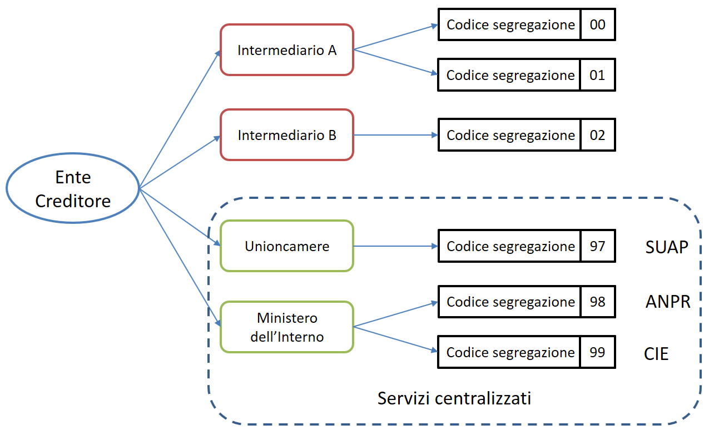



+---------------------------------------------------------------------------------------------------+
| **SPECIFICHE ATTUATIVE DEI CODICI IDENTIFICATIVI DI VERSAMENTO, RIVERSAMENTO E RENDICONTAZIONE**  |
|                                                                                                   |
|                                                                                                   |
| *Allegato A alle "Linee guida per l'effettuazione dei pagamenti elettronici a favore delle*       |
| *pubbliche amministrazioni e dei gestori di pubblici servizi"*                                    |
|                                                                                                   |
|                                                                                                   |
| **Versione 1.3.1 - gennaio 2018**                                                                 |
+---------------------------------------------------------------------------------------------------+

.. _generazione-dellidentificativo-univoco-di-versamento:

2. Generazione dell’Identificativo Univoco di Versamento          |image1|
========================================================

Secondo quanto definito nel `paragrafo 7.1 delle Linee guida.  <http://www.agid.gov.it/sites/default/files/linee_guida/lineeguidapagamenti_v_1_1_0_0.pdf>`_ 
 
*« ..., ciascun Ente Creditore attribuisce ad ogni operazione di incasso un
codice identificativo denominato “Identificativo Univoco di Versamento”
(IUV) che non può essere associato nel tempo ad alcun altro incasso
emesso dal medesimo Ente Creditore .....».*

Il codice IUV assume quindi una rilevanza fondamentale *« ... al fine di
consentire le attività di riconciliazione del pagamento da parte degli
Enti Creditori e quelle di riversamento a cura dei Prestatori di servizi
di pagamento... »* rappresentando pertanto uno degli elementi essenziali
sui quali si base il sistema pagoPA\ :sup:`®`.

Lo stesso `paragrafo 7.1 delle Linee guida <http://www.agid.gov.it/sites/default/files/linee_guida/lineeguidapagamenti_v_1_1_0_0.pdf>`_ 
concede agli Enti Creditori la
possibilità di *« .... demandare ad un soggetto terzo, in tutto o in
parte, la generazione dell’Identificativo Univoco di Versamento, curando
che ne sia mantenuta l’univocità nel tempo».*

.. _struttura-del-codice-iuv:

2.1 Struttura del Codice IUV
----------------------------
La generazione di un codice IUV che risulti **univoco** nel corso del
tempo è una responsabilità in capo all'Ente Creditore, che è libero di
strutturarne la composizione secondo le proprie esigenze, facendo
attenzione che tale codifica sia conforme agli standard internazionali
esistenti e tenga conto in prima istanza della natura del pagamento
(dovuto o spontaneo) ed in seconda istanza del numero dei “punti di
generazione” del codice stesso (:ref:`vedi § 2.1.2 <punti-di-generazione-del-codice-iuv>`).

.. _natura-del-pagamento:

2.1.1 Natura del pagamento
~~~~~~~~~~~~~~~~~~~~~~~~~~

Come indicato nel `capitolo 2 delle SANP <http://pagopa-specifichepagamenti.readthedocs.io/it/latest/_docs/Capitolo2.html#modelli-del-processo-di-pagamento>`_ (Allegato B alle Linee guida),
gli incassi che un Ente Creditore deve gestire possono essere distinti
secondo due diverse modalità:

-  su iniziativa dell’Ente Creditore (o dovuti): è il caso in cui
   l’ente, attraverso un avviso (analogico o digitale), richiede un
   pagamento all’utilizzatore finale;

-  su iniziativa del debitore (o spontanei): nei quali l’utilizzatore
   finale - che deve effettuare, a vario titolo, un versamento a favore
   dell’ente - si attiva in via autonoma.

Nel primo caso (avviso analogico o digitale), in cui il pagamento può
essere eseguito attraverso i canali messi a disposizione dai PSP 
(`cfr. § 2.2 delle SANP <http://pagopa-specifichepagamenti.readthedocs.io/it/latest/_docs/Capitolo2.html#processo-di-pagamento-attivato-presso-il-psp>`_), 
si rinvia al successivo § 0.

Nella seconda eventualità, associata ai pagamenti attivati preso l'Ente
Creditore (`cfr. § 2.1 delle SANP <http://pagopa-specifichepagamenti.readthedocs.io/it/latest/_docs/Capitolo2.html#processo-di-pagamento-attivato-presso-lente-creditore>`_), si rimanda :ref:`al successivo § 2.3 <codice-iuv-caso-pagamenti-ente-creditore>`. Si
tenga presente che, se l’utilizzatore finale decide di effettuare il
pagamento in un tempo successivo e allo scopo richiede la stampa di un
avviso analogico oppure l'invio di un avviso digitale, si ricade nel
caso precedente.

.. _punti-di-generazione-del-codice-iuv:

2.1.2 Punti di generazione del codice IUV
~~~~~~~~~~~~~~~~~~~~~~~~~~~~~~~~~~~

Il sistema pagoPA\ :sup:`®` consente ad un Ente Creditore di utilizzare
uno più intermediari e/o partner tecnologici: tale circostanza fa si che
la generazione dello IUV possa avvenire in maniera indipendente presso
più soggetti e possibilmente non sotto il controllo diretto dell’Ente
Creditore.

Tale situazione può essere presente anche presso Enti Creditori dotati
di un'organizzazione complessa e articolata in più unità autonome, che
hanno la necessità di generare il codice IUV in maniera indipendente.

Definiamo quindi "punto di generazione del codice IUV" qualsiasi entità,
facente parte o meno dell'organizzazione dell'Ente Creditore, incaricata
da questo di associare un codice IUV ad un unico pagamento presente
nell'archivio dei pagamenti in attesa di cui al 
`capitole 7 delle Linee guida. <http://www.agid.gov.it/sites/default/files/linee_guida/lineeguidapagamenti_v_1_1_0_0.pdf>`_  

.. _il-codice-di-segregazione:

2.1.3 Il codice di segregazione
~~~~~~~~~~~~~~~~~~~~~~~~~~~~~~~

Tutto ciò premesso, è necessario definire delle regole affinché la
codifica del pagamento risulti effettivamente univoca all'interno
dell'Ente Creditore nel corso del tempo: questo risultato si ottiene
associando ad ogni punto di generazione del codice IUV un particolare
codice che serve a segregare i domini di gestione dei pagamenti
dell'ente.

Tale codice viene denominato "codice di segregazione".

L'Agenzia per l'Italia Digitale attribuisce il codice di segregazione ad
ogni punto di generazione del codice IUV in funzione del soggetto che
svolge il ruolo di intermediario o partner tecnologico, secondo la
seguente classificazione:

a. **Erogatori di servizi centralizzati**: intermediari tecnologici,
   riconosciuti da AgID, che erogano servizi in modalità accentrata a
   livello nazionale;

b. **Punti di generazione del Codice IUV**: qualsiasi intermediario o
   partner tecnologico che non rientra nella classificazione precedente,
   nonché le unità autonome dell'ente.

Uno schema delle modalità di attribuzione del Codice Segregazione è
riportata in Figura 2.

|image2|

**Figura 2 - Attribuzione del codice segregazione**

.. _erogatori-di-servizi-centralizzati:

2.1.3.1 Erogatori di servizi centralizzati
~~~~~~~~~~~~~~~~~~~~~~~~~~~~~~~~~~~~~~~~~~

Sono quei soggetti, censiti a livello generale, che erogano servizi
centralizzati per una comunità di Enti Creditori con riferimento a
procedure specifiche: quali, ad esempio, il SUAP, l'emissione on-line
della Carta di Identità Elettronica, l'emissione dei certificati
anagrafici tramite ANPR, ecc.

In alcuni casi - come ad esempio quello legato all’emissione on-line
della CIE o dei certificati anagrafici, che consentono di effettuare
contestualmente il pagamento del servizio - l’utilizzo della procedura
centralizzata sarà obbligatorio per tutti i comuni italiani.

L'attribuzione della qualifica di erogatore di servizi centralizzati
deve essere richiesta all'AgID che provvederà ad aggiornare l'elenco
riportato in Tabella 1.

**Tabella** **1 - Elenco servizi centralizzati**

+-------------------------+------------------------------------+-------------------------------+
| **codice segregazione** | **Soggetto che eroga il servizio** | **Servizio**                  |
+-------------------------+------------------------------------+-------------------------------+
| 99                      | Ministero dell'Interno             | Emissione on-line CIE         |
+-------------------------+------------------------------------+-------------------------------+
| 98                      | Ministero dell'Interno             | Emissione certificati da ANPR |
+-------------------------+------------------------------------+-------------------------------+
| 97                      | Unioncamere                        | SUAP                          |
+-------------------------+------------------------------------+-------------------------------+
| 96                      | Automobile Club d’Italia           | Pago bollo                    |
+-------------------------+------------------------------------+-------------------------------+

.. _punti-di-generazione-del-codice-iuv-1:

2.1.3.2 Punti di generazione del codice IUV
~~~~~~~~~~~~~~~~~~~~~~~~~~~~~~~~~~~~~~~~~~~

AgID attribuirà uno o più codici segregazione (progressivamente a
salire: da 00 a 49) ad ognuno degli intermediari/partner tecnologici,
ovvero entità autonome dell'Ente Creditore, secondo quanto da questi
richiesto.

Se un Ente Creditore genera in proprio attraverso entità autonome il
codice IUV e si avvale contemporaneamente di un intermediario o di un
partner tecnologico, le entità autonome dovranno essere censite alla
stregua di intermediario/partner dello stesso ente.

.. _numero-avviso-e-codice-IUV-pagamenti-presso-psp:

2.2 Numero avviso e codice IUV nel caso di pagamenti attivati presso i PSP
--------------------------------------------------------------------------

Nel caso dei pagamenti attivati presso il PSP è sempre presente un
avviso di pagamento (analogico o digitale) al quale è associato un
Numero Avviso che contiene al suo interno il codice IUV. La struttura
del Numero Avviso [2]_ è specificata dallo schema (A), dove i componenti
indicati assumono il seguente significato:

+------------------------------------------------------------------------------------------------------------------------------------+
| <aux digit (1n)>[<application code> (2n)]<codice IUV (15|17n)> (A)                                                                 |
+----------------------+-------------------------------------------------------------------------------------------------------------+
| **aux digit**        | Valore numerico che definisce la struttura del                                                              |
|                      | codice IUV in funzione del numero di punti di generazione dello stesso (vedi Tabella 2 a pagina 15);        |
+----------------------+-------------------------------------------------------------------------------------------------------------+
| **application code** | Valore numerico che serve ad individuare la porzione                                                        |
|                      | dell’archivio dei pagamenti in attesa interessata dall’operazione [3]_.                                     |
|                      | Il dato è presente o meno in funzione del componente                                                        |
|                      | <aux digit> (vedi Tabella 2 a pagina 15);                                                                   |
+----------------------+-------------------------------------------------------------------------------------------------------------+
| **codice IUV**       | Rappresenta l'identificativo univoco di versamento, così come definito nel                                  |
|                      | `paragrafo 7.1 <http://www.agid.gov.it/sites/default/files/linee_guida/lineeguidapagamenti_v_1_1_0_0.pdf>`_ |
|                      | delle Linee guida. Ad un singolo pagamento in attesa può essere associato uno ed un solo codice IUV,        |
|                      | indipendentemente dai possibili diversi strumenti messi a disposizioni dal PSP.                             |
|                      |                                                                                                             |
|                      | Per la struttura del codice IUV si                                                                          |
|                      | :ref:`veda il § 2.2.1. <composizione-del-codice-iuv>`                                                       |
+----------------------+-------------------------------------------------------------------------------------------------------------+

Si noti come, nella rappresentazione del precedente schema e di quelli
successivi, i componenti all'interno delle parentesi quadre possano non
essere presenti nell'oggetto, mentre il carattere “|” indichi la
presenza in alternativa dei vari componenti oppure i possibili valori
che può assumere la lunghezza del componente stesso.

.. _composizione-del-codice-iuv:

2.2.1 Composizione del codice IUV
~~~~~~~~~~~~~~~~~~~~~~~~~~~~~~~~~

La composizione del **codice IUV** è rappresentata dallo schema (B) come
concatenazione dei suoi componenti, che assumono il seguente
significato:

+-------------------------------------------------------------------------------------------+
| [<Codice segregazione (2n)>]<IUV base (13|15|17n)>[<IUV check digit (2n)]> (B)            |
+-------------------------+-----------------------------------------------------------------+
| **Codice segregazione** | Valore numerico che rappresenta il **Codice di Segregazione**   |
|                         | (:ref:`vedi § 2.1.3 <il-codice-di-segregazione>`)               |
|                         | Il componente è presente o meno nella struttura del             |
|                         | codice IUV in funzione del componente                           |
|                         | <aux digit> del Numero Avviso (vedi Tabella 2)                  |
+-------------------------+-----------------------------------------------------------------+
| **IUV base**            | Valore numerico che ogni Ente Creditore è libero di             |
|                         | strutturare secondo le proprie esigenze, nei limiti indicati    |
|                         | dalle presenti specifiche attuative.                            |
|                         | Il componente assume una lunghezza variabile in funzione        |
|                         | del componente <aux digit> del Numero Avviso                    |
|                         | (vedi Tabella 2)                                                |
+-------------------------+-----------------------------------------------------------------+
| **IUV check digit**     | Rappresenta il codice di controllo dello IUV,                   |
|                         | calcolato con l'algoritmo precisato nei paragrafi successivi.   |
|                         | Il componente è presente o meno nella struttura del codice IUV  |
|                         | in funzione del componente <aux digit> del Numero Avviso        |
|                         | (vedi Tabella 2 a pagina 15)                                    |
+-------------------------+-----------------------------------------------------------------+

La previsione del carattere di controllo dello IUV (<IUV check digit>)
non comporta per il PSP l’obbligo bensì la facoltà di verifica,
consentendo al PSP stesso di controllare il Numero Avviso, con evidente
efficientamento del processo di pagamento in quanto evita
preventivamente la ricezione di risposte negative inviate dall’Ente
Creditore.

.. _generazione-del-numero-avviso-e-del-codice-iuv:

2.2.2 Generazione del Numero Avviso e del codice IUV
~~~~~~~~~~~~~~~~~~~~~~~~~~~~~~~~~~~~~~~~~~~~~~~~~~~~

La necessità di gestire l’emissione del codice IUV presso più “punti di
generazione”, nonché quella di trattare particolari situazioni in essere
presso gli Enti Creditori, viene realizzata attraverso l’assegnazione di
valori diversi al componente <aux digit> del Numero Avviso, cosi come
indicato in Tabella 2, dove i valori assegnati a tale componente
determinano sia la presenza, sia la lunghezza degli altri componenti del
codice IUV e del Numero Avviso.

**Tabella** **2 - Composizione del codice avviso in funzione dei punti
di generazione dello IUV**

+---------------+---------------+----------------+-----------------+--------------+----------+--------------+
|**Punti**      |**<aux digit>**|**<application**|**<codice**      |**Lunghezza** |**<IUV**  |**Lunghezza** |
|**generazione**|               |**code>**       |**segregazione>**|**<IUV base>**|**check** |**codice IUV**|
|**IUV**        |               |                |                 |              |**digit>**|              |
+===============+===============+================+=================+==============+==========+==============+ 
| 1             | 0             | si             | no              | 13           | si       | 15           |
+---------------+---------------+----------------+-----------------+--------------+----------+--------------+
| 1             | 1             | no             | no              | 17           | no       | 17           |
+---------------+---------------+----------------+-----------------+--------------+----------+--------------+
| ≥ 1           | 2             | no             | no              | 15           | si       | 17           |
+---------------+---------------+----------------+-----------------+--------------+----------+--------------+
| > 1           | 3             | no             | si              | 13           | si       | 17           |
+---------------+---------------+----------------+-----------------+--------------+----------+--------------+

Come si vede da un'analisi della Tabella 2, nei casi in cui <aux digit>
sia diverso da 0 la lunghezza del codice IUV è di 17 posizioni a scapito
del componente <application code> che scompare e, in alcuni casi, viene
sostituito dal componente <codice segregazione> (:ref:`vedi § 2.1.3 <il-codice-di-segregazione>`).

.. _valore-0-del-componente-aux-digit:

2.2.2.1 Valore 0 del componente <Aux Digit>
~~~~~~~~~~~~~~~~~~~~~~~~~~~~~~~~~~~~~~~~~~~

Si tratta dello schema per la composizione del numero utilizzabile
solamente se il "punto di generazione del codice IUV" sia unico. Lo
schema (NAV.0) evidenzia la composizione da utilizzare per il numero
avviso:

+-----------------------------------+-----------------------------------+
| **0<application code (2n)><IUV    | **(NAV.0)**                       |
| base (13n)><IUV check digit       |                                   |
| (2n)>**                           |                                   |
+-----------------------------------+-----------------------------------+

L'Ente Creditore può prevedere più porzioni dell’Archivio dei Pagamenti
in Attesa (APA), mentre la composizione del codice IUV è definita dallo
schema (IUV.0) sotto evidenziato:

+--------------------------------------------+-------------+
| **<IUV base (13n)><IUV check digit (2n)>** | **(IUV.0)** |
+--------------------------------------------+-------------+

dove il componente <IUV check digit> si calcola come resto della
divisione per 93 del numero ottenuto concatenando i componenti <aux
digit>, <application code> e <IUV base>.

.. _valore-1-del-componente-aux-digit:

2.2.2.2 Valore 1 del componente <Aux Digit>
~~~~~~~~~~~~~~~~~~~~~~~~~~~~~~~~~~~~~~~~~~~

Si tratta di uno schema previsto per tutelare particolari situazioni
pre-esistenti alla emanazione delle Linee guida [4]_; tale schema è
utilizzabile solamente se il "punto di generazione del codice IUV" sia
unico. Lo schema (NAV.1) evidenzia la composizione da utilizzare per il
numero avviso:

+-----------------------+-------------+
| **1<IUV base (17n)>** | **(NAV.1)** |
+-----------------------+-------------+

Il codice IUV è formato dal componente <IUV base>, manca il componente
<IUV check digit >.

L'Ente Creditore ha un archivio APA non partizionato oppure gestisce in
proprio la segregazione tra le varie procedure aziendali, in questo caso
è compito dell'ente attivare la procedura aziendale di competenza.

.. _valore-2-del-componente-aux-digit:

2.2.2.3 Valore 2 del componente <Aux Digit>
~~~~~~~~~~~~~~~~~~~~~~~~~~~~~~~~~~~~~~~~~~~

Si tratta di uno schema previsto per gestire Enti Creditori di grandi
dimensioni, che però utilizzano un archivio APA non partizionato oppure
che gestiscono in proprio la segregazione tra le varie procedure
aziendali, anche in questo caso è compito dell'ente attivare la
procedura aziendale di competenza.

Lo schema è utilizzabile se il "punto di generazione del codice IUV" è
unico. Gli Enti Creditori che usufruiscono di servizi centralizzati
(:ref:`vedi § 2.1.3 <il-codice-di-segregazione>`) possono utilizzare questo schema se, nella generazione
dello IUV, hanno cura che i primi due caratteri a sinistra del
componente <IUV base> siano diversi dai tutti i valori presenti nella
colonna “codice segregazione” di Tabella 1 relativa agli erogatori di
servizi centralizzati.

Lo schema (NAV.2) evidenzia la composizione da utilizzare per il numero
avviso:

+---------------------------------------------+-------------+
| **2<IUV base (15n)><IUV check digit (2n)>** | **(NAV.2)** |
+---------------------------------------------+-------------+

La composizione del codice IUV è definita dallo schema (IUV.2) sotto
evidenziato:

+--------------------------------------------+-------------+
| **<IUV base (15n)><IUV check digit (2n)>** | **(IUV.2)** |
+--------------------------------------------+-------------+

dove il componente <IUV check digit> si calcola come resto della
divisione per 93 del numero ottenuto concatenando le componenti <aux
digit> e <IUV base>.

.. _valore-3-del-componente-aux-digit:

2.2.2.4 Valore 3 del componente <Aux Digit>
~~~~~~~~~~~~~~~~~~~~~~~~~~~~~~~~~~~~~~~~~~~

Si tratta di uno schema previsto per gestire gli enti che hanno più di
un intermediario/partner tecnologico, cioè enti per i quali il "punto di
generazione del codice IUV" non è unico; lo schema (NAV.3) evidenzia la
composizione da utilizzare per il numero avviso:

+----------------------------------------------------------------------+-------------+
| **3<codice segregazione (2n)><IUVbase (13n)><IUV check digit (2n)>** | **(NAV.3)** |
+----------------------------------------------------------------------+-------------+

La composizione del codice IUV è definita dallo schema (IUV.3) sotto
evidenziato:

+-----------------------------------------------------------------------+--------------+
| **<codice segregazione (2n)><IUV base (13n)><IUV check digit (2n)>**  | **(IUV.3)**  |
+-----------------------------------------------------------------------+--------------+

dove il componente <IUV check digit> si calcola come resto della
divisione per 93 del numero ottenuto concatenando i componenti <aux
digit>, <codice segregazione > e <IUV base>.

Resta inteso che è compito dell'Ente Creditore e/o dei suoi
Intermediari/partner tecnologici attivare correttamente la porzione di
archivio APA interessata dal pagamento.

A completamento di quanto sopra indicato, si sottolinea che anche gli
Enti Creditori non intermediati o intermediati da un unico soggetto
possono adottare - di concerto con il proprio intermediario, se presente
- gli schemi di generazione dello IUV proposti in questo paragrafo,
senza richiedere all’Agenzia l’assegnazione di uno più specifici codici
segregazione.

.. _codice-iuv-caso-pagamenti-ente-creditore:

2.3 Codice IUV nel caso di pagamenti attivati preso l'Ente Creditore
--------------------------------------------------------------------

Come già indicato, l’Ente Creditore è libero di strutturare secondo le
proprie esigenze la composizione del codice IUV, tenendo in debito conto
che tale codifica deve essere predisposta in conformità agli standard
internazionali, in particolare dovrà essere rispettato il limite massimo
di 35 caratteri imposto dagli standard SEPA usati per la disposizione di
accredito (vedi capitoli 4 e 6).

In alternativa, il codice IUV può essere generato rispettando lo
Standard ISO 11649:2009 (vedi Appendice 1) denominato anche
“*Structured Creditor Reference*”, standard che comporta notevoli
vantaggi in termini di riconciliazione per l’Ente Creditore [5]_ 
(cfr. *SEPA Credit Transfer scheme customer-to-bank implementation guidelines*).

Tutto ciò premesso, il codice IUV può essere pertanto generato secondo
uno dei due seguenti schemi:

+------------------------------------------------------------------------------------+
| <codice alfanumerico (max 35)>                                                 (C) |
+------------------------------------------------------------------------------------+
| RF <check digit (2n)><codice alfanumerico (max 21)>                            (D) |
+------------------------------------------------------------------------------------+

Nel caso in cui presso un Ente Creditore siano presenti “punti di
generazione” del codice IUV tra loro diversi e non coordinati 
(:ref:`vedi §§ 2.1.2 <punti-di-generazione-del-codice-iuv>` e 
:ref:`2.1.3 <il-codice-di-segregazione>`), 
il codice IUV, generato per essere usato nell'ambito dei
pagamenti attivati presso l'ente, potrà essere composto secondo uno dei
due seguenti schemi:

+----------------------------------------------------------------------------------------+
| <codice segregazione (2n)><codicealfanumerico (max 33)>                            (E) |
+----------------------------------------------------------------------------------------+
| RF <check digit (2n)><codice segregazione (2n)><codice alfanumerico (max 19)>      (F) |
+----------------------------------------------------------------------------------------+

Si tenga in ogni caso presente che, al fine di evitare duplicazioni
nella generazione del codice IUV, la lunghezza del componente <codice
alfanumerico> dovrà essere costante nel corso del tempo.

.. [2]
   La struttura del Numero Avviso si adegua a prassi e standard
   "de-facto" preesistenti e consolidati presso i PSP.

.. [3]
   La componente <**application code>** identifica il singolo archivio
   di pagamenti in attesa e viene indirizzato mediante i meccanismi di
   configurazione del Nodo dei Pagamenti-SPC, che in questo modo sarà in
   grado di individuare il canale corretto di inoltro delle richieste di
   verifica e attivazione di pagamento 
   (`cfr § 8.2.3 delle SANP <http://pagopa-specifichepagamenti.readthedocs.io/it/latest/_docs/Capitolo8.html#pagamenti-in-attesa-e-richiesta-di-generazione-della-rpt>`_

   In sintesi questa informazione rappresenta "l'indirizzo"
   dell'archivio dove sono conservate le richieste in attesa che hanno
   dato luogo all’avviso di pagamento.

.. [4]
   È il caso, ad esempio, dell'Ente Creditore Equitalia che identifica
   le proprie cartelle con un codice denominato RAV, che ha le stesse
   caratteristiche di lunghezza e formato del codice IUV, ma utilizza
   regole diverse di generazione.

.. [5]
   Si veda, ad esempio, il documento “RF Creditor reference” al seguente indirizzo

   `https://www.ebaportal.eu/_Download/Research%20and%20Analysis/2010/rf_creditor_reference.pdf  <https://www.ebaportal.eu/_Download/Research and Analysis/2010/rf_creditor_reference.pdf>`__,

   Vedi anche il calcolatore di Creditor Reference alla pagina
   `http://www.jknc.eu/RFcalculator <http://www.jknc.eu/RFcalculator>`__

.. |image0| image:: media/image1.png

.. |image1| image:: media/image5.png
   :width: 0.7874in
   :height: 0.24059in

